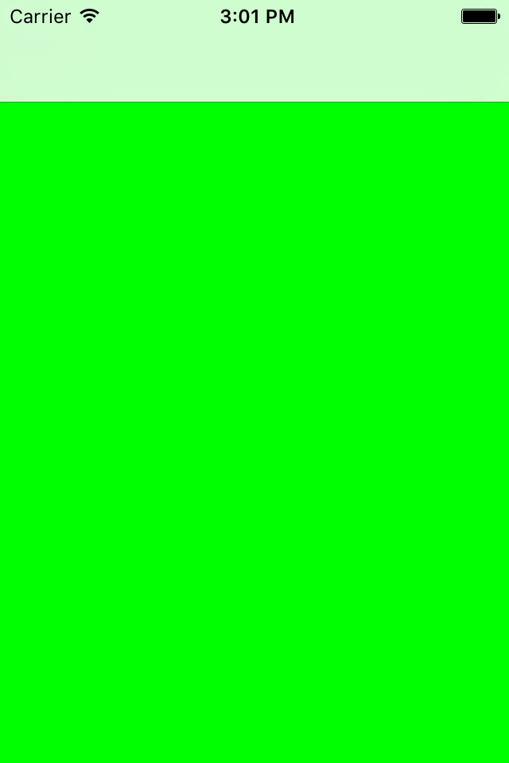
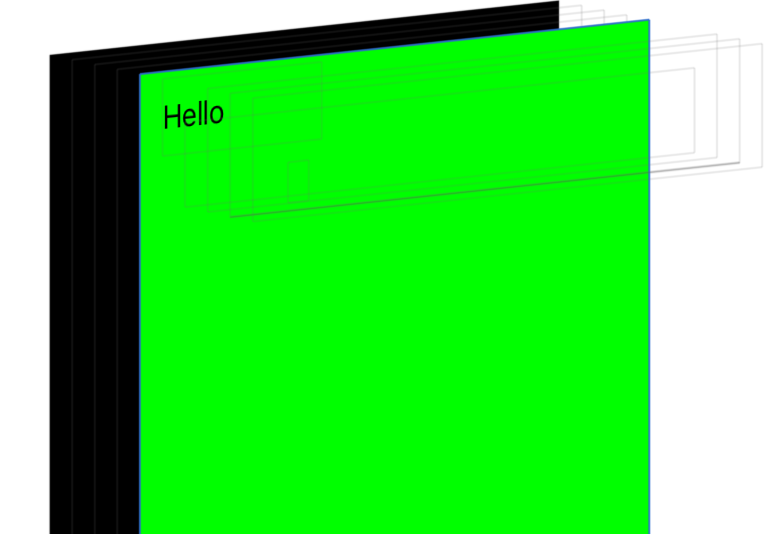
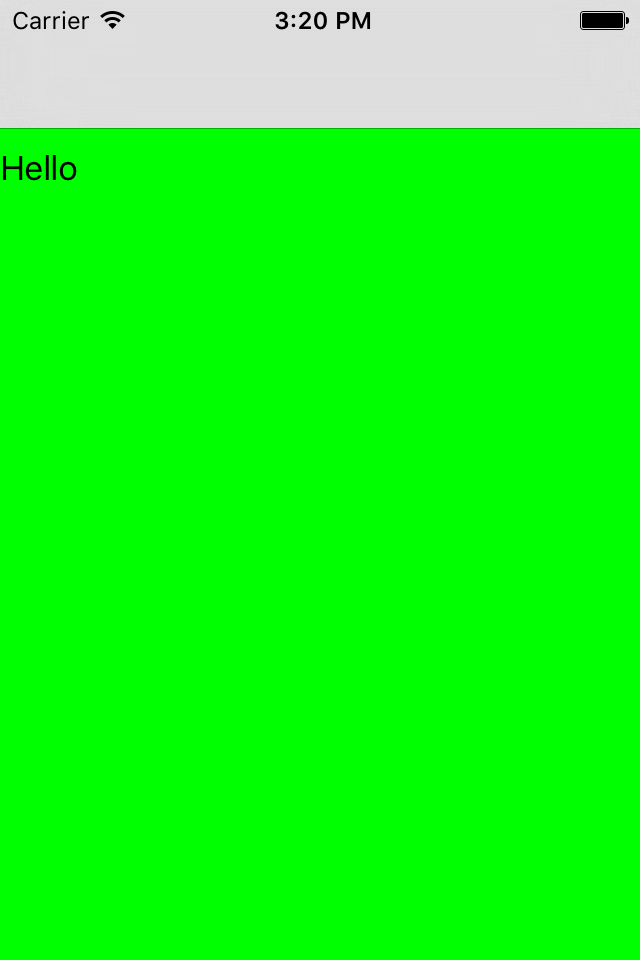
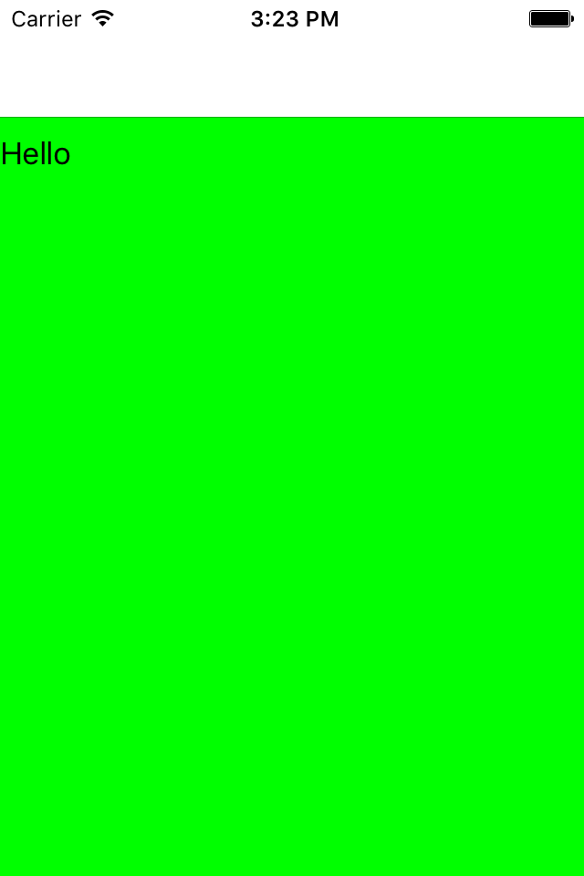
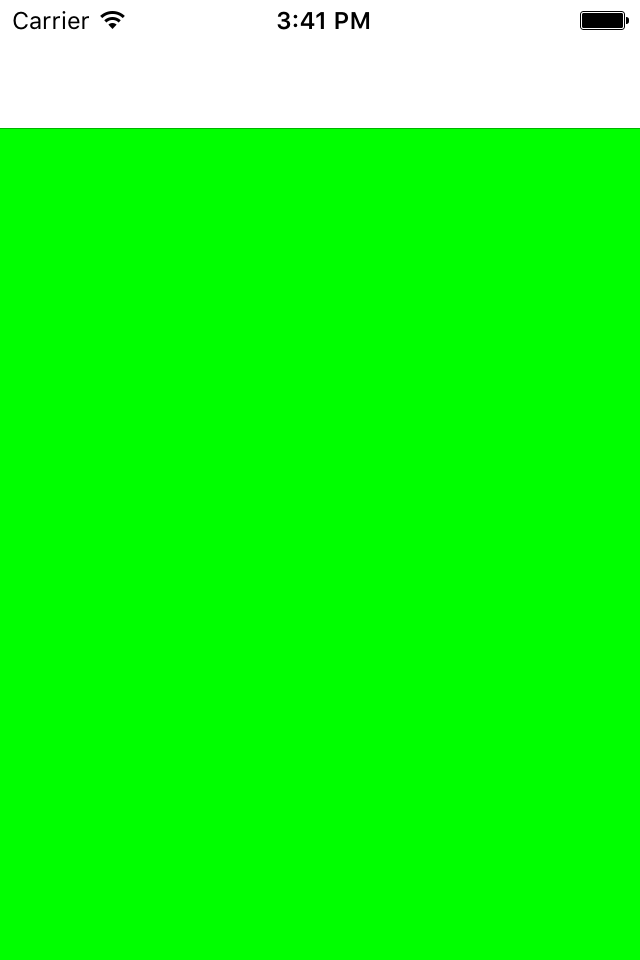
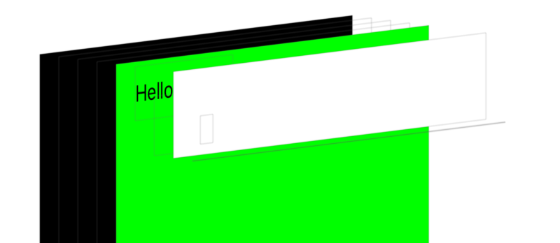
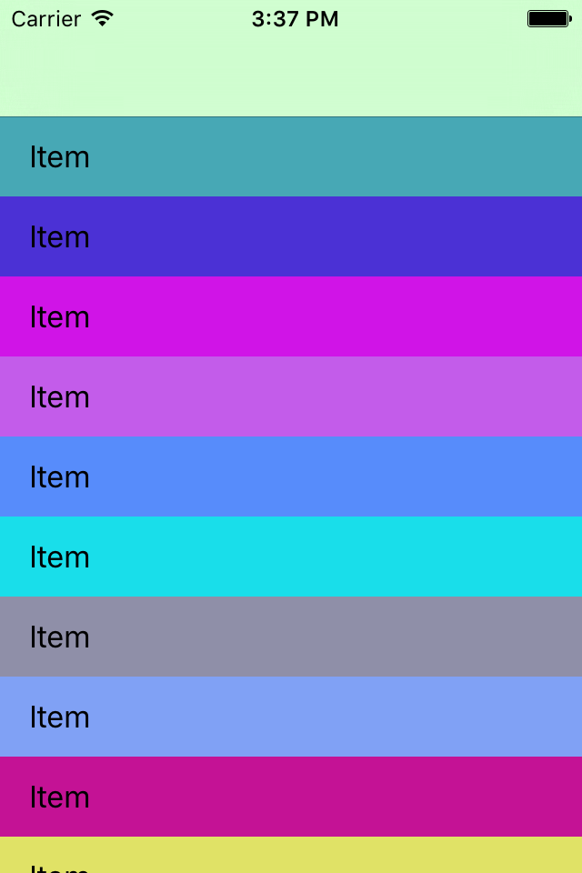
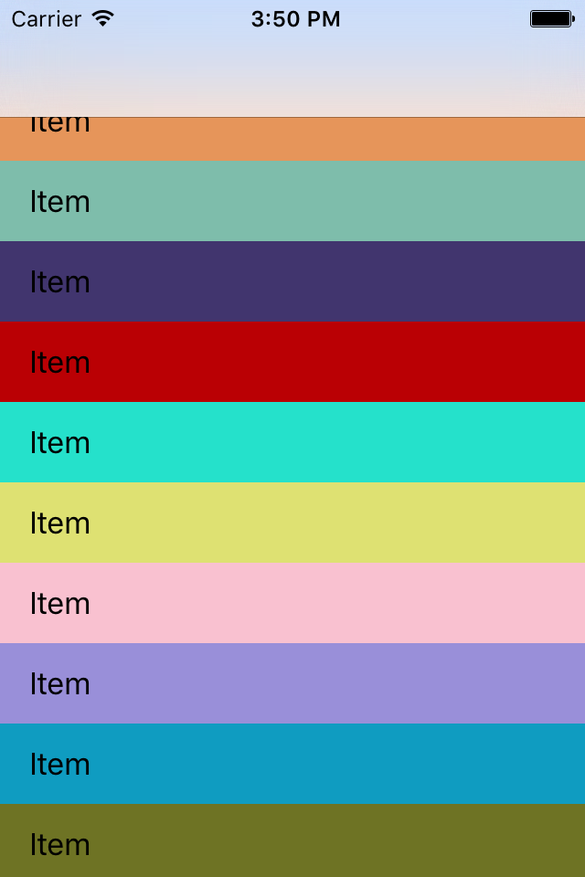
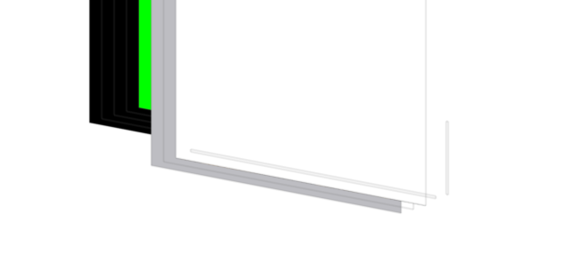

UINavigationBar 透明设置以及对 frame 的影响
========================================

从 iOS7 之后，所有的 UINavigationBar 默认都是透明的了，同时 View Controller 全部都使用全屏的 layout。为了提供更多调整 view 的选项，苹果又引入了 edgesForExtendedLayout， extendedLayoutIncludesOpaqueBars，automaticallyAdjustsScrollViewInsets 这几个属性用于控制 VC 的 view layout。在网上看了好多文章感觉都说的不是很清楚，这里试着根据例子做一下总结。

首先创建一个 Single View 的工程，设置 Navigation Controller 和 rootViewController:

```objective-c
MyViewController *vc = [[MyViewController alloc] init];
UINavigationController *nav = [[UINavigationController alloc] initWithRootViewController:vc];

self.window.rootViewController = nav;
[self.window makeKeyAndVisible];
```

在 MyViewController 里把背景设置为绿色：

```objective-c
- (void)viewDidLoad {
    self.view.backgroundColor = [UIColor greenColor];
}
```

运行，可以看到下面的结果：



注意到导航栏式透明的，就是大家在 iOS7 中喜闻乐见的毛玻璃效果。下面绿色的 View 仍然是在全屏幕范围内进行布局的，导致我们可以透过导航栏看到下层的绿色。

全屏幕布局带来了一个问题，当我们想在 View 里添加东西时：

```objective-c
UILabel *label = [[UILabel alloc] initWithFrame:CGRectMake(0, 0, 100, 40)];
label.text = @"Hello";

[self.view addSubview:label];
```

运行的结果：


WTF! 老子的 label 呢？。。。其实 Label 是被加进去的，只不过藏在导航栏下面了，通过 inspector 我们可以看到更清楚一些：



想解决这个问题，最简单的办法就是调整 Label 的 frame。不过手动调整怎么看也是比较脏的解决方案。幸亏苹果已经提前想到这个问题了，不需要我们手动调整。根据苹果提供的 API，有两种办法，一种是调整 edgesForExtendedLayout。这个属性指示了下层 view 扩展 layout 的方向，默认值是 UIRectEdgeAll，就是会向各个方向扩展（其实在这里能扩展的方向也只有上方），我们可以更改这个属性：

```objective-c
- (void)viewDidLoad {
    self.edgesForExtendedLayout = UIRectEdgeNone;
}
```

运行结果：



另一种方式是把导航栏改成不透明:

```objective-c
UINavigationController *nav = [[UINavigationController alloc] initWithRootViewController:vc];
nav.navigationBar.translucent = NO;
```

效果如下：



注意到导航栏的细微不同了吗？第一种做法导航栏仍然是透明的，我们还可以隐约看到下面的黑色部分，第二种做法导航栏就完全不透明了，变成了纯白色。

对于不透明的导航栏，如果你还想让 View 充满全屏的话，苹果也提供了一个属性可以满足你，就是 extendedLayoutIncludesOpaqueBars，如果把它设置为 YES，那么在不透明导航栏下， view 仍然会在全屏幕布局，结果就成了下面这样：



在 Inspector 里我们可以看到藏在后面的 Label:



上面说的是对于一个普通的 View，对于 UITableView 来说，你会发现我们不需要什么设置就可以得到正确的结果。如果我们用一个 UITableView 作为 rootViewController，效果如下：



可以看到导航栏是透明的（显示出了下面的绿色背景）， TableView 的 Cell 也正确的显示了。

为啥这种就不需要我们配置呢？原因在于 automaticallyAdjustsScrollViewInsets。这个参数默认设置为 YES，其作用是把子 View 中最下层的 ScrollView 的 UIEdgeInsets 进行调整，在这里是设置成 (64, 0, 0, 0)，这样 TableView 的 Cell 位置就正确地显示在导航栏下方的位置了。

如果你强制把 automaticallyAdjustsScrollViewInsets 设置成 NO，就会出现下面的结果：



可以看到，TableView 的第一个 cell 跑到导航栏下面去了。

看样子不透明的导航栏会需要的设置会少一些，不过不透明导航栏其实也有自己的坑。。。例如，当我们想在 VC 中添加一个 WebView 时：

```objective-c
- (void)viewDidLoad {
    
    self.view.backgroundColor = [UIColor greenColor];
    
    UIWebView *webView = [[UIWebView alloc] initWithFrame:self.view.bounds];
    [webView loadRequest:[NSURLRequest requestWithURL:[NSURL URLWithString: @"https://www.bing.com/" ]]];
    [self.view addSubview:webView];
}
```

你会发现，WebView 顶部的位置没有问题，但是底部的位置出现错乱了，成了这样：



导致没办法滚动到网页的最低端了。

出现这个问题的原因是，在 viewDidLoad 里 Navigation Controller 还没有正确调整好下面 View 的属性，导致我们使用 self.view.bounds 是获取的是错误的大小。一种解决办法是把设置 frame 的代码放到 viewWillAppear 里：

```objective-c
- (void)viewWillAppear:(BOOL)animated {
    [super viewWillAppear:animated];
    UIWebView *webView = [[UIWebView alloc] initWithFrame:self.view.bounds];
    [webView loadRequest:[NSURLRequest requestWithURL:[NSURL URLWithString: @"https://www.bing.com/" ]]];
    [self.view addSubview:webView];
    
}
```

这样 WebView 的大小就是正确的了，不过这种方法不一定好用，有时候可能在 viewWillAppear 里 view 的 frame 还是没有调整完。

另一种解决方法是，设置 extendedLayoutIncludesOpaqueBars 为 YES：

```objective-c
self.extendedLayoutIncludesOpaqueBars = YES;
```

这个解决办法貌似有点奇怪，为什么我们设置让 View 往上伸展，却解决了 View frame 设置不对的问题呢？原因还是在于神奇的 automaticallyAdjustsScrollViewInsets。如果我们把它关掉:

```objective-c
self.extendedLayoutIncludesOpaqueBars = YES;
self.automaticallyAdjustsScrollViewInsets = NO;
```

WebView 的顶部就伸展到导航栏下面去了。可以看到，extendedLayoutIncludesOpaqueBars 把 View 做扩展，还是要受到 automaticallyAdjustsScrollViewInsets 的限制，后者的作用产生在前者之后。

参考资料：

* https://stackoverflow.com/questions/18798792/explaining-difference-between-automaticallyadjustsscrollviewinsets-extendedlayo
* http://redth.codes/ios7-full-screen-layout/
* http://www.cnblogs.com/wdsunny/p/4556378.html