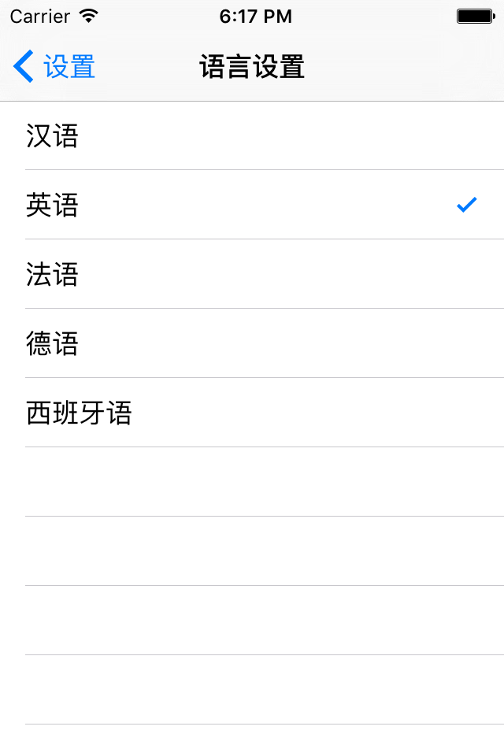

浅析 iOS 开发中 VC 之间数据传递的方式
================================

iOS 开发中 VC 之间数据的传递和交换可以有很多种方法，下面介绍常见的几种方式，并且从设计和架构的层次上分析一下不同方法的优缺点和适用场景。内容主要来自于笔者自己在开发中的实践和思考，如果有错误或者遗漏，欢迎联系指正。

为了方便描述，我们举一个实际的用例。假设我们有一个设置界面 SettingViewController，其中有一项是语言设置，显示当前选择的语言。


点进去之后进入到具体的语言设置界面 LanguageViewController，其中是汉语，英语，法语等一系列的选项。



现在假设我们在 SettingVC 中知道用户的选项是“英语”。为了让用户的体验更好，在用户点击“语言设置”进入 LanguageVC 的时候，里面“英语”这一项应该就处于选择状态了，这时候就需要进行 SettingVC -> LanguageVC 的正向数据传递。同样，当用户在 LanguageVC 中选择了一个新的语言，SettingVC 需要根据用户的选择更新自己的显示，这里就需要 LanguageVC -> SettingVC 的反向数据传递。

### 正向传递

#### 使用 property

首先我们来看正向的数据传递。正向传递最容易想到的就是使用 @property 了，我们可以在 LanguageVC 中定义一个属性：

```objectivec
@property (nonatomic) NSUInteger selectedIndex;
```

然后在向 LanguageVC push 的时候把它设置好：

```objectivec
LanguageViewController *vc = [[LanguageViewController alloc] init];
vc.selectedIndex = self.currentSelectedIndex;
[self.navigationController pushViewController:vc animated:YES];
```

#### 使用 initializer

使用属性很简单，但是当要设置的属性很多时，会导致代码过于冗余。如果要设置很多属性，我们可以通过自定义 `init `方法来简化代码：

```objectivec
LanguageViewController *vc = [[LanguageViewController alloc] initWithIndex:self.currentSelectedIndex name:self.languageName];
```

#### 使用 Router

上面的实现虽然达到了目的，但是却导致了 SettingVC 和 LanguageVC 之间出现了强耦合。为了避免 VC 之间的强耦合，借鉴 Web 开发的思想，我们可以引入一个中介性质的 router，来完成 VC 之间的数据传递。以 [HHRouter](https://github.com/Huohua/HHRouter) 为例，首先我们把 LanguageVC 注册到路由中：

```objectivec
[[HHRouter shared] map:@"/lang/:index/" toControllerClass:[LanguageViewController class]];
```
在 LanguageVC 中实现 `setParams:` 用来接收参数：

```objectivec
- (void)setParams:(NSDictionary)params {
    self.selectedIndex = [params[@"index"] integerValue];
}
```
然后通过带参数的 URL，来取出对应的 VC：

```objectivec
UIViewController *vc = [[HHRouter shared] matchController:@"/lang/1/"];
[self.navigationController pushViewController:vc animated:YES];
```

这样便实现了参数的传递，同时并没有引入对于 LanguageVC 的强依赖，是一种比较好的解决方案。

在 [MVVMReactiveCocoa](https://github.com/leichunfeng/MVVMReactiveCocoa) 中，作者使用了一种基于 Model 的 router，同样实现了类似的效果，有兴趣的可以去看一下它的源码。

### 反向传递

反向传递相对于正向传递要难一些，最容易想到的方法就是在 LanguageVC 中保留一个 SettingVC 的弱引用，然后调用有关的方法，但是这种做法又带来了强依赖，因此不建议使用。通常使用的方法有下面几种：

#### Delegate

Delegate(委托) 是 iOS 系统库中大量使用的一种设计模式。委托可以很方便地做到接口和实现的分离，降低了依赖性（依赖于接口而不依赖于实现）。我们也可以使用委托模式来实现反向的数据传递。

首先我们定义一个 Protocol，同时在 LanguageVC 中设置一个实现了这个 Protocol 的 delegate 对象属性：

```objectivec
@protocol LanguageSelectionProtocol <NSObject>
@required
- (void)didSelectLanguageAtIndex:(NSUInteger)index;
@end

@interface LanguageViewController : UITableViewController
@property (nonatomic, weak) id<LanguageSelectionProtocol> delegate;
@end
```

当用户在 LanguageVC 中做出选择时，我们可以调用 delegate 方法来实现数据回调：

```objectivec
- (void)tableView:(UITableView *)tableView didSelectRowAtIndexPath:(NSIndexPath *)indexPath {
    if ([self.delegate respondsToSelector:@selector(didSelectLanguageAtIndex:)]) {
        [self.delegate didSelectLanguageAtIndex:indexPath.row];
    }
}
```

注意到由于我们使用了 delegate，我们并没有强依赖于 SettingVC，不管是什么对象，只要是实现了对应 Protocol 的都是可以的。

在 SettingVC 中，只要把自己设置为 LanguageVC 的 delegate ，然后实现对应的 protocol 方法就可以了：

```objectivec
LanguageViewController *vc = [[LanguageViewController alloc] init];
vc.delegate = self;
[self.navigationController pushViewController:vc animated:YES];
```

**优点：** Delegate 实现了完全的面向接口编程，达到了很好的解耦效果。

**缺点：** 使用略显繁琐，需要定义对应的 Protocol 和持有 delegate 对象。另外，当一个 VC 实现了过多的 Protocol 的时候，会导致代码难以维护。

#### Block

从 iOS 4.0 开始我们可以使用 Block 来实现匿名函数，由于 Block 的闭包性质，也可以使用它来实现参数传递。

首先在 LanguageVC 中定义一个 Block 属性：

```objectivec
@property (nonatomic, copy) void (^languageSelectionBlock)(NSUInteger index);
```

然后在用户选择的时候调用 Block 方法：

```objectivec
- (void)tableView:(UITableView *)tableView didSelectRowAtIndexPath:(NSIndexPath *)indexPath {
    if (self.languageSelectionBlock) {
        self.languageSelectionBlock(indexPath.row);
    }
}
```

在 SettingVC 中，不再需要实现 delegate 方法，直接进行 block 赋值即可：

```objectivec
LanguageViewController *vc = [[LanguageViewController alloc] initWithIndex:self.currentSelectedIndex];
vc.languageSelectionBlock = ^(NSUInteger index){
    // Do something
};
```

**优点**：可以看到，和 delegate 相比，block 使用起来语法更加简明方便，不需要定义 protocol。同时 block 本身是一个对象，是可以进行传递的，用法比 delegate 要灵活很多。

**缺点**：由于 block 会捕获外部的对象，使用 block 很容易造成内存泄露问题，需要多加小心。同时 block 层次过多也会使得回调层数太深，导致代码难以维护。

### 其他方法

除了上面提到的方法，iOS 系统内部还提供了几种用于数据共享和传递的机制：

#### NSNotification

NSNotification 是 iOS 自带的一个通知机制，对象可以注册和监视通知，可以以通知中心为中介，实现信息的发送和接受。

**优点：** NSNotification 支持多播，即一个通知被多个对象接收，这一点是上面的几种方式所不能提供的，另一方面，NSNotification 是全局性质的，因此不会受到 VC 层次的影响，很适合跨 VC 的消息传递。

**缺点：** NSNotification 的优点也正是它的缺点。由于它多播以及全局的性质，很容易造成通知的污染，因此在编程中要注意不要接收自己不感兴趣的通知。

#### KVO

KVO(Key-Value Observing)是系统自带的一种消息传递机制，可以实现对象之间对某个属性值的观察。

**优点：** KVO 可以对属性值实现细粒度的观察，这一点是别的方法不容易做到的，也是很有用的一个特性。

**缺点：** KVO 语法使用很繁琐，同时由于 KVO 本身的实现基于 Runtime，对于原始类型（struct 等）是没有用处的，这一点也限制了 KVO 的应用场景。

除此之外，使用 NSUserDefaults 或者 AppDelegate 本身也能实现数据的传递，不过在设计上和上面介绍的几种方法相比，并没有什么独特的优势，在这里就不再赘述了。
