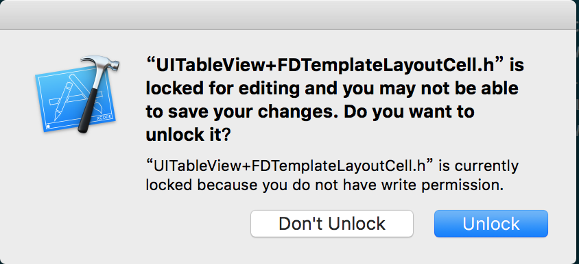

基于 CocoaPods 和 Git 的 iOS 工程组件化实践
=======================================

### 前言

上一篇文章[《浅析 iOS 应用组件化设计》](https://skyline75489.github.io/post/2016-3-16_ios_module_design.html)发出之后，有读者反馈（并没有）想了解一下实现 iOS 组件化的具体步骤。本着本博客一贯的面向初学者友好的原则，特此新开一篇文章，详述一下使用 CocoaPods 和 Git 进行 iOS 组件化开发的具体流程。

**注**：本流程仅供学习参考，其中所有展示的代码均为虚构，如有雷同，你一定是在逗我。

---

对于一个没有实施过组件化拆分的工程来说，其中很可能充满了大量不合理的类，方法，头文件和各种错乱的依赖关系，因此首先要进行的第一步是模块拆分。

### 一、模块拆分

模块拆分可以分成两个部分，基础模块拆分和业务模块拆分。基础模块通常是稳定的依赖代码，业务模块是涉及到业务的需要频繁改动的代码。我们想达到的目标有下面几点：

* 对于基础模块来说，其本身应该是自洽的，即可以单独编译或者几个模块合在一起可以单独编译。
* 所有的依赖关系都应该是业务模块指向基础模块的。
* 基础模块之间尽量避免产生横向依赖。

#### 基础模块拆分

对于基础模块来说，我们直接通过把基础模块单独拆分成 Pod，来进行模块的划分，而不是在旧有的工程上去建立新的 Group 之类的。这样做有一个明显的好处，**Pod 当中如果引用了主工程当中的头文件，会直接造成编译失败**。这样强迫我们拆分出来的 Pod 一定是对主工程没有依赖的（即没有反向依赖）。

具体的做法如下：首先我们把选择一个可以单独拆分的模块，把所有的文件从主工程中删除掉，放到一个新的文件夹里，例如这里我们把一些基础的头文件拆出来，取名为 `XXBaseHeaders`。创建一个新的文件夹，名为 `XXBaseHeaders`，在里面创建一个子文件夹 `Headers` 和 `XXBaseHeaders.podspec`，把旧代码放到 `Headers` 文件夹当中，现在目录结构看起来应该是这样的：

```no-highlight
XXBaseHeaders
- Headers
  - XXFoundation.h
  - XXMacro.h
  - ...
- XXBaseHeaders.podspec
```

然后我们开始编辑 podspec：

```ruby
Pod::Spec.new do |s|
  s.name = "XXBaseHeaders"
  s.version = "1.0.0"
  s.source_files = "Headers/*.{h,m}"
end
```

只需这么简单的几行，这个 pod 就可以在本地工作了，需要注意的一点是，这里的 `name`，文件夹名称，podspec 本身的文件名，这三个需要都是一致的，不然会报错。

现在主工程已经编译不过去了，因为我们去掉了几个文件，现在我们通过 Podfile 把它们再加到主工程里面，在已有的 Podfile 里加入下面这一行：

```ruby
pod 'XXBaseHeaders', :path => '../XXBaseHeaders/'
```

注意这里的 `:path` 我使用的是相对路径，实际使用时不管用哪种路径，只要可以找到我们刚才创建的 Pod 文件夹就可以。还需要注意一点，就是 Pod 的名称也是要和文件夹名称这些保持一致。

然后我们通过执行下面的命令，把这个 Pod 安装到主工程当中：

```no-highlight
pod install --verbose --no-repo-update
```
 
由于我们想添加的是一个本地的 Pod，所以我们加入了 `--no-repo-update`  来避免更新远程 Spec 仓库，加快安装速度。

安装成功之后，主工程的 Pods 看起来是这样的：


可以看到这里 CocoaPods 把我们本地的仓库放到了 `Development Pods` 里面。这里和下面那些 Pods 的区别在于，下面的 Pods 本身是从主仓库下载然后拷贝到当前工程中，默认权限是只读的，如果尝试修改会出现类似下面的提示：




而 `Development Pods` 则不是进行的拷贝，而是直接**引用**了本地 Pod 的文件，可以直接做修改，因为实际上就是在修改 `XXBaseHeaders` 这个文件夹里的文件。

现在我们已经把模块的代码拆分成了单独的 Pods，可以尝试进行编译了。如果原有的代码依赖控制的比较好的话，进行不多的改动就可以编译成功了。如果发现没办法通过简单的改动让代码通过编译的话，有可能有下面几种情况：

* 出现了反向引用，即引用了主工程中头文件
* 几个模块之间有循环引用的情况，即互相依赖对方
* 使用 Umbrella Header 或者 pch 导致了隐式依赖

对于第一种情况，要区分一下所引用的头文件属于基础模块还是业务模块。如果是基础模块的话，说明所引用的模块比我们当前在拆的模块还要更加“基础”一点，需要把它也拆分出来。如果是业务模块的话，多半是出现了不合理的代码，这种时候需要对代码进行修改了。把依赖业务模块的部分单独拆出来，让基础模块保持干净。

第二种情况，当我们拆分出几个模块之后，可能碰到。在前期的拆分中，基础模块的循环引用还是能够接受的，如果这几个基础模块不会引用到业务模块，就可以暂时先放着，之后再处理。

最难办的是第三种情况，有的时候我们为了方便，会定义一个包含了其它很多 Header 的 Header，类似这样：

```objectivec
/*
*	XXKit.h
*/

#import "XXFoundation.h"
#import "XXMacro.h"
#import "XXExtension.h"
// ...
```

这种 Header 被称为 "Umbrella Header"。对于一个内部完全自洽的模块来说，使用 Umbrealla Header 来对外提供接口是很方便的，例如最常用 `UIKit.h`：

```objectivec
#import <UIKit/UIKitDefines.h>

#if __has_include(<UIKit/UIAccelerometer.h>)
#import <UIKit/UIAccelerometer.h>
#import <UIKit/UIAccessibility.h>
#endif

#import <UIKit/UIAccessibilityConstants.h>

#if __has_include(<UIKit/UIActivityIndicatorView.h>)
#import <UIKit/UIActivityIndicatorView.h>
#import <UIKit/UIActivity.h>
#import <UIKit/UIActivityItemProvider.h>
#import <UIKit/UIActivityViewController.h>
#import <UIKit/UIActionSheet.h>
#import <UIKit/UIAlertController.h>
#import <UIKit/UIAlertView.h>
// ...
```

但是在我们的应用工程中，使用 Umbrella Header 很容易导致多余的依赖。例如我们在一个业务模块里面引入了 `XXKit.h`，但是实际使用到的其实只有 `XXMacro.h` 当中的某个宏。如果再使用了 pch，那么依赖就变得更加隐式了。

当我们试图把 `XXKit.h` 拆到 Pod 里的时候，它本身就是一个拥有非常多依赖的模块。对于这种情况，我们要么选择一拆到底，把 `XXKit.h` 当中所 import 的所有东西都拆出来，形成类似 `UIKit.h` 那种结构。要么选择去掉 `XXKit.h`，将所有的依赖显式地写出来。前者可能会导致 XXKit 模块过于庞大，后者可能会导致需要添加大量的 import 代码。

我个人倾向于后者，显式地写出依赖更利于之后进一步的模块化。

通过重复上面提到的拆分过程，我们可以逐渐地把基础依赖从主工程中剥离出来，变成可以直接引用的 Pod。

#### 业务模块拆分

对于业务模块来说，考虑到旧有代码可能没有相关的横向解耦策略，业务模块之间的依赖会非常复杂，难以单独进行拆分，因此我们采用的方法是首先从 group 角度进行重新整理。这样做的好处了降低了成本，同时保证这个过程中代码一直是能够通过编译的。

对业务量很大的工程来说，我个人更加推荐“业务-分层”这样的结构，而不是“分层-业务”，即类似下面的 group 结构：

```no-highlight
- BusinessA
  - Model
  - View
  - Controller
  - Network
- BusinessB
  - Model
  - View
  - Controller
  - Network
```  

这样有利于之后我们把某个业务模块单独剥离出来，也方便开发者快速找到对应业务有关的代码。

当两个不同的业务都依赖一个组件，例如两个页面的业务都需要完成一个相同的网络请求，可以考虑把这个相同的部分单独拆分成一个小的业务，即更加细粒度的业务。尽量避免创建 Common 这样的模块。

#### 风险控制

在拆分模块的过程中，有可能会出现代码在复制粘贴的过程中发生遗漏，或者拆分的代码版本不是最新的代码，导致某个已经修复的 bug 再次被引入。为了避免这种情况，需要注意在拆分代码之前，检查代码是不是最新的代码库里面的，同时除非必要，尽量做整个文件（整个类）的迁移。

另外整个工程在拆分之前都是要在版本控制之下的。当出现问题时，可以从版本控制中拿回旧有的代码，重新放回工程中进行回滚。

### 二、私有 Spec 仓库搭建

#### 上传 Pod 到私有 Spec 库

通过上面的步骤，我们把模块拆分成了单独的 Pod，为了让整个项目组都能使用这些 Pod，我们需要在内网环境（或者其它的私有环境）上搭建自己的 Spec 仓库，方便所有人在本地安装依赖环境。

在创建 Spec 仓库之前，首先我们要在远端把各个模块的仓库先单独建立起来。继续以 XXBaseHeaders 为例，我们在目录下创建 git 仓库：

```no-highlight
git init
```

并添加远端仓库，这里以我用自己的 Coding 账号创建了公开仓库：

```no-highlight
git remote add origin git@git.coding.net:skyline75489/XXBaseHeader.git
```

在 push 仓库之前，我们先对 podspec 做些修改：

```ruby
Pod::Spec.new do |s|
  s.name = "XXBaseHeaders"
  s.authors = "Someone"
  s.homepage = "https://coding.net/u/skyline75489/p/XXBaseHeader/git"
  s.summary = "XXBaseHeaders"
  s.version = "1.0.0"
  s.source           = { :git => "git@git.coding.net:skyline75489/XXBaseHeader.git", :branch => "master" }
  s.source_files = "Headers/*.{h,m}"
end
```

其中 `s.source` 比较重要，写清楚了这个 pod 对应的 git 仓库和分支。其它字段主要是为了通过 CocoaPods 的格式检查，对实际使用没有影响。

下面我们把 pod push 到远端：

```no-highlight
git push --set-upstream origin master
```
 
下一步，我们创建一个私有的 Spec 仓库，这里面存放的是我们需要的 Pod 的索引，我在 Coding 上创建了一个 MySpec 仓库，我们先把它加到 CocoaPods 当中：

```no-highlight
pod repo add MySpec git@git.coding.net:skyline75489/MySpec.git
```
    
这里面现在还是空的，下面我们把 XXBaseHeaders push 到仓库中，相当于发布出去：

```no-highlight
pod repo push MySpec XXBaseHeaders.podspec --allow-warnings
```
    
首先要确保有 MySpec 这个仓库的写权限，才能发布成功。成功之后，MySpec 仓库会有下面这样的目录结构：

```no-highlight
XXBaseHeader
- 1.0.0
  - XXBaseHeader.podspec
```

现在使用 `pod search XXBaseHeader`，如果操作正确的话，应该可以搜索到我们刚刚发布的 pod：

```no-highlight
-> XXBaseHeaders (1.0.0)
XXBaseHeaders
pod 'XXBaseHeaders', '~> 1.0.0'
- Homepage: https://coding.net/u/skyline75489/p/XXBaseHeader/git
- Source:   git@git.coding.net:skyline75489/XXBaseHeader.git
- Versions: 1.0.0 [MySpec repo]
```   
    
现在在 Podfile 中我们可以使用远程仓库的 XXBaseHeader 作为依赖了，就像使用普通的第三方库一样：

```ruby
pod 'XXBaseHeaders', '1.0.0'
```

为了方便其他人使用，最好在 Podfile 中把我们私有源的地址加进去，这也是 CocoaPods 推荐的做法：

```ruby
source 'git@git.coding.net:skyline75489/MySpec.git'
```
这样不需要对私有 Spec 进行 `pod repo add` 也可以找到对应的仓库了。

#### 结合 Git Tag 进行版本锁定

在开发当中有一个代码锁定的概念，我们希望主工程的代码一直是**稳定**的，不会因为子工程的更改而发生变化。只有当我们准备好接受子工程更新的时候，才把子工程代码引入主工程。回顾一下上面的 podspec 中的内容：

```ruby
s.source = { :git => "git@git.coding.net:skyline75489/XXBaseHeader.git", :branch => "master" }
```

我们指定让 CocoaPods 去对应仓库的 master 分支寻找代码，这就意味着如果两个不同的开发者在 `pod install` 的过程的间隙，我们向子模块的 master 分支 push 了新的代码，那么他们两个人得到的代码其实是不相同的。对于主仓库而言，重新 `pod install` 导致子模块的代码已经发生变化，这就引起了主仓库 code base 的不稳定，会引发很多问题。

为了避免这种情况，我们在 podspec 当中指定到对应仓库的某个 tag，确保通过 podspec 得到的代码是稳定的。

下面我们来给 XXBaseHeaders 发布一个新的版本，通过这个例子来展示具体的做法。

首先对已有的 XXBaseHeaders 文件做一些必要的修改，然后进行 commit。确定修改完成，准备好发布版本的时候，修改 podspec：

```ruby
s.version = "1.0.1"
s.source  = { :git => "git@git.coding.net:skyline75489/XXBaseHeader.git", :tag => s.version.to_s }
```

这里我们让 tag 和版本号保持一致，commit 之后，给仓库打上 tag：

```no-highlight
git tag 1.0.1
```

然后把修改推送到远程：

```no-highlight
git push
git push --tags
```

重复前面讲过的发布的步骤，我们把新版本发布的 MySpec 之后，就可以使用新版本的 Pod 了。所不同的是，通过对 tag 的指定，我们可以确保使用同一个版本号 `1.0.1` 拿到的 XXBaseHeaders 代码一定是相同的。

#### 风险控制

搭建私有 Spec 的过程不会对工程代码有破坏性的影响。需要注意的是，对于 Spec 仓库权限的控制很重要。由于 Spec 仓库实际上就是一个普通的 git 仓库而已，任何有权限的人都可以修改。一旦有些修改不小心破坏了仓库的结构，就可能直接影响到仓库的正常工作。因此最好只允许少数几个人拥有仓库的写权限，其他人想要发布模块的时候，都把 podspec 交给权限所有者来做。

### 三、开发流程控制

#### Git 工作流程

现在我们从单一的主工程，变成了主工程+多个拆分好的基础模块+统一的私有 Spec 仓库。为了避免某个人的工作对其他人开发环境造成影响，需要对整个组的开发流程进行统一的规范。

不管是对于主仓库和子模块仓库，[git-flow](http://nvie.com/posts/a-successful-git-branching-model/) 都是首先推荐的工作流程。对于小型的团队来说，全盘使用 git-flow 可能会带来一些效率上的影响。这时可以使用简化版的 gif-flow——[Github-flow](https://guides.github.com/introduction/flow/)，即基于 Pull Request 的工作流程：


上图来源于 Github 提供的 PDF。下面简单描述一下整个流程：

一个仓库的 master 分支只有所有者可以有权限更改，其他的贡献者想更改的话，需要自己创建新的分支（在 Github 上就是进行 fork），然后进行更改，之后把更改向原仓库发送 Pull Request。Pull Request 就是一个合并的请求，其中可以看到贡献者的更改，项目主人和其他维护者可以对 Pull Request 进行审核，共同探讨修改意见。当项目主人认为修改 OK 之后，就可以合并这个 Pull Request ，把这部分代码合并到主分支。

这个流程是完全分布式的，也就是说可以同时有多个贡献者在不同的分支进行工作，最后统一合并到主分支上，实现并行协作。

同时在审核 Pull Request 阶段，除了人工审核代码之外，Github 还加入了对于持续集成的支持，可以检测这个 Pull Request 是不是能够通过测试的，进一步保证了代码的质量。

结合前面提到的分模块部分，对于主仓库和模块仓库来说，都可以采用这个工作流程。模块仓库要做的就是不断地往 master 分支合并 PR，同时在适当的时候在 master 分支打 tag，发布新版本。主仓库要做的也是类似的工作，同时如果子模块有更新的话，要更新 Podfile 里对应的 Pod 版本号。

#### 托管平台选择

要想使用上面提到的 Github Flow 流程，一个在线的代码托管平台是必不可少的。

付费的选择有 Github 自家的 [Github Enterprise](https://enterprise.github.com/home)，以及 Atlanssian 家的 [BitBucket Server](https://bitbucket.org/product/server)。

免费的选择有国内的 [Coding](https://coding.net/)，[Git@OSChina](http://git.oschina.net/) 以及 [CSDN Code](https://code.csdn.net/)。它们的均以不限个数的免费私有仓库作为卖点。另外 BitBucket 本身支持 5 个免费的私有仓库，对于项目不多的团队也够用了。

如果有服务器资源的话，更好的方案是自己利用开源的方案搭建私有的托管平台，可以最大限制地保证代码的安全。开源方案当中最知名也是最为广泛使用的当属 [Gitlab](https://about.gitlab.com/)。它提供了免费开源的社区版，也提供收费的企业版（类似 Github Enterprise）。Gitlab 的功能十分强大，能够完整地支持 Pull Request 工作流程。Gitlab 比较大的缺点是部署很繁琐，尽管有基于 Docker 的虚拟化部署方案，仍然可能会遇到很多问题。

[Gogs](https://gogs.io/) 是一个后起之秀，它使用 Go 语言编写，是一个完全开源的项目。借助于 Go 语言的特性，Gogs 的部署十分简单，解决了 Gitlab 一个很大的痛点。同时 Gogs 的功能也不弱于 Gitlab，背后的社区也很活跃。相比于 Gitlab ，我更推荐使用 Gogs 作为自搭 Git 平台的解决方案。
