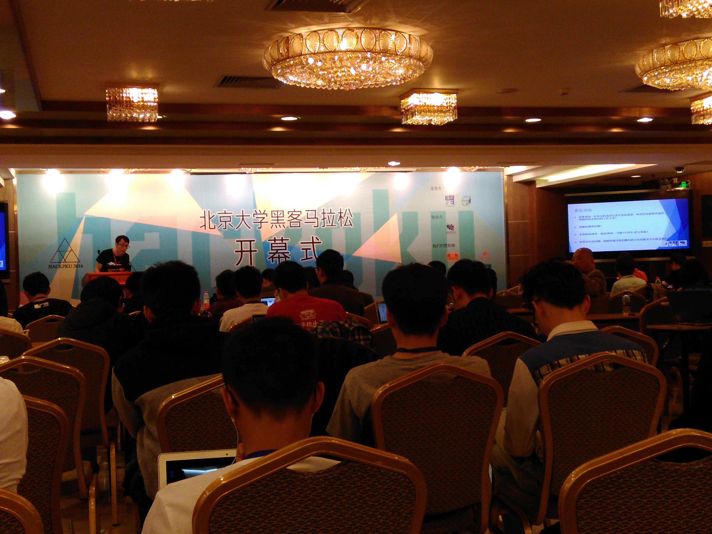
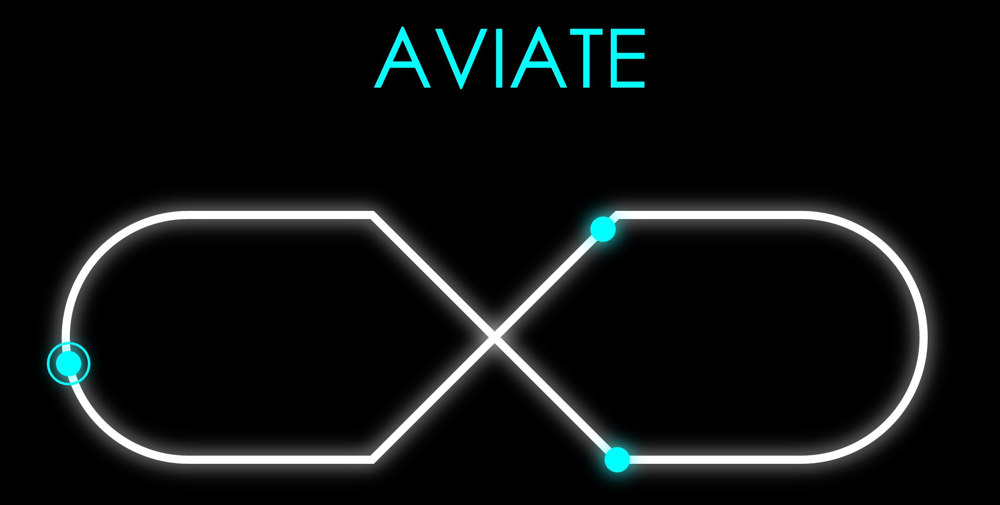

2016 HackPKU 参赛小记
====================

2016 年 4 月 8 日，我前往北京参加了人生中第一次黑客马拉松活动。

#### 0x00 概述

我们的队伍成员有多次黑客马拉松经验的 [wxygeek](https://www.zhihu.com/people/wxygeek)（江湖人称狗哥，[他的经历](http://blog.wxygeek.com/hack-the-world/)），有留学澳洲的[铨哥](https://www.zhihu.com/people/zhao-guo-quan-78)，有颜值爆表的[宝姐](https://www.zhihu.com/people/mac-turing)，有颜值珠峰一般的[澜澜](https://www.zhihu.com/people/winlandiano)（可惜澜澜由于临时有事，只参与了头脑风暴的部分，没有留下宝贵的皂片）。其中除了狗哥和宝姐之外，剩下的我们都没有参加过黑客马拉松的经验。我个人是抱着不坑队友 & 体验生活的心态来参赛的。由于这是我第一次参加黑客马拉松活动（同时这也是北大第一次举办黑客马拉松活动），没办法做横向的对比，只能从我自己的角度对这次经历进行一个记录。

#### 0x01 开幕 & 赞助商

本次黑客马拉松的签到地点和开幕式地点没有设置在一起（其中签到的地点还是在地下一层），因为第一次来北大，对环境也不是很熟悉，幸亏有在北大上学的高中同学的指引，才比较顺利地找到了该去的地点。由于签到的人数比较多，像组织报销这种工作并没有像通知中说的在签到现场进行，而是延后了一些，现在看来这个决策是正确的，避免了更多的混乱。不过还是希望主办方以后能在通知上做到更加准确一些。

这次比赛的赞助商比较大牌的有 IBM，微软，搜狐，友盟等，其中有几个公司的代表在开幕式上进行了致辞。我感觉有些可惜的是，赞助商中缺少了诸如 Coding 这样知名的抱枕和杯子厂商，因此除了 T 恤之外也没有收获别的纪念品。

HackPKU 这次的奖项设置并没有在官网挂出来，在开幕式上都是很晚才提到。相比于其他 Hack 动辄上万的奖金，这届比赛的奖项设置稍显逊色，不过作为北大第一次筹办的比赛，能够做到这样也已经非常不容易了。

#### 0x02 环境

比赛的环境在新太阳活动中心的地下一层，在有 170 名参赛选手的情况下，现场的空间还是显得比较充足。除了工作区域之外，零食区和赞助商咨询区也都在同一个场地。不过比赛现场并没有提供休息区，也没有提供睡袋等，因此为了更好的休息，我们团队选择了住附近的宾馆。

在参赛之前我对于环境比较担心的就是两点，电和网。这次 HackPKU 提供了一个八口的大插线板，还是比较良心的，加上我自己带的一个备用插线板，用电的问题基本没有了。

这次主要有问题的是现场的网络。主办方没有提供单独的网络，而是使用了北大自己的无线网络，同时提供了上网账号。现场北大本校的同学可以使用自己的账号上网，而我们外校的同学不得不共享同一个账号。更坑爹的是，这个账号还有同时接入设备数量的限制，50 台设备的限制很容易就超出了。因此我们不得不使用分享网络等办法曲线上网。然而已有的网络连接也并不稳定，分享的网络更是不稳定上再加一层不稳定。在现场大概有一半左右的时间，我是在没有网的环境下工作的。碰到突然网络好使了，就抓紧时间把代码 push 上去，场面可谓凄惨。

因为网络的原因，我们选择住宾馆的决策显得更加明智了。比赛的两夜我们都在十二点之前就离开了比赛现场，回到宾馆继续战斗。

#### 0x03 饮食

像我这种对于吃饭基本没什么要求的人来说，这次比赛的正餐和零食我都是比较满意的。正餐基本做到了准时发放，零食也基本做到了不限量随时取。正餐的话是真功夫提供的套餐，有几个不同的套餐可以选择，量上看不是特别大，不过一份不够还可以再去取。主办方本来是准备了餐票，后来提供的食物上是供大于求的，因此也没有再做什么限制。

零食方面基本是随时都有的，想拿一直都可以去拿，饮料方面也提供了红牛，咖啡这种帮助大家持续奋战的工具。不过我自己还是以吃正餐为主。总体上吃饭方面没有遇到什么问题。

#### 0x04 项目

我们的项目叫做 Aviate，是一个多人实时在线音乐节奏类游戏。我们项目的特点是新颖的多人分屏协作游戏模式以及和 Kinect 结合的节奏输入功能。

为了现场演示时的效果，我们制作了演示视频。其中一个是演示分屏游戏：

<embed src="http://player.youku.com/player.php/sid/XMTUzMTg1MjIyOA==/v.swf" allowFullScreen="true" quality="high" width="480" height="400" align="middle" allowScriptAccess="always" type="application/x-shockwave-flash"></embed>

另一个是铨哥身体力行，演示使用 Kinect 作为输入端，使用树莓派控制的 LED 灯给用户提供反馈，通过动作来创建节奏：

<embed src="http://player.youku.com/player.php/sid/XMTUzMTg1MTA3Ng==/v.swf" allowFullScreen="true" quality="high" width="480" height="400" align="middle" allowScriptAccess="always" type="application/x-shockwave-flash"></embed>

整个项目从创意到实现到最后展示，并没有大家看起来那么一帆风顺，实际情况可谓是一波三折。

周五晚上开幕式结束之后，我们讨论比赛项目的方向。在创意阶段，我们经过了很长时间的头脑风暴，最终决定了做跨平台音乐游戏这个方向。由于我们队伍中大家都不是专业的前端开发，其中只有我和狗哥有写前端和 JavaScript 的经验，因此当时我们对于整个项目能否真正实现并不是特别有信心。

周六白天，我们对于项目所需要的技术进行探索，最终发现整体项目在实现上还是可行的，不至于难到做不了的程度。前端方面，狗哥和我通力合作，解决了几个关键性的 Bug 之后，前端的开发方向显得比较明朗了。后面狗哥开始专注前端开发，我自己则转向后端开发。为了方便协作，我选择了狗哥的主力技能点——Node 作为开发方向。

至于和 Kinect 以及树莓派结合的部分，更是很晚才最终确定方向。在游戏本身和硬件结合的部分上，我们为了做到有创意同时又要显得不生硬，进行了很多的思考和讨论，甚至一度考虑过放弃。不过大家最后还是坚持了下来，想出了一个足够好的创意。加上铨哥的 Kinect 开发经验和宝姐的硬件开发经验，实现方面我们也做出了比较好的效果。事实证明，Kinect 以及树莓派的结合对于整个项目来说是一个非常大的加分项。

周日上午的自由展示过程，评委对于我们的项目给出的基本都是正面评价，我们顺利地进入了前六名，得到了现场演示的机会。在现场演示的环节，我们做了很充分的准备。尽管现场网络出现了一些问题，我们仍然可以通过视频进行补救，加上狗哥高端大气的演讲，演示环节现场的反响很热烈，特别是 Kinect 和树莓派环节收到了很多的掌声。最终我们拿到了这次 HackPKU 的冠军。

#### 0x05 评奖

这次比赛的评奖总体还是比较客观公正的，进入前六名的项目都有自己独特的亮点。对于前三名的选择也可以看出评委们还是很用心的。

让我感觉评委用心的主要是 [K-Link](http://devpost.com/software/hackpku) 这个项目。这个项目是一个浏览器插件，可以让用户在浏览网页时，和其他浏览这个网页的人进行互动，进行评论乃至聊天等。这个项目在我看来在创意，实用性和技术难度上都达到了一定水平。只是这个项目本身并不适合于演示。在自由展示环节我甚至都没有注意到有这个项目。在前六名的现场展示环节，K-Link 团队的两个程序员同学也表现的比较腼腆，展示效果并不理想，以至于我自己都没有感觉出这个项目的亮点。相信大部分现场同学跟我的感觉是差不多的。然而最终 K-Link 还是拿到了三等奖，打败了非常抓眼球的无人机游戏项目 WarDrone，以及完成度和展示水平都很高的 iOS 项目 Emotion-Diary。这足以说明评委的评价标准并不单单限于演示效果的酷炫，技术和实用性上的水平也是考量的指标。

至于我们自己的项目，获奖主要靠是炫酷的创意+跨平台+软硬结合+一定的技术难度+比较高的完成度，这诸多方面的亮点结合到一起，形成了一个非常具有竞争力的项目，得到了评委的青睐。

#### 0x06 总结

作为第一次参加黑客马拉松活动的我来说，这次经历简直不能更完美了。现在回忆起这 36 个小时的经历，仍然感觉不可思议 & 难以置信。靠谱的队友 + 好玩的创意 + 曲折的经历 + 获奖的结果，我真的不知道还能要求什么了。总结一下这次的经验，我想到了下面几点：

1. 靠谱的队友很重要。我们的队伍有狗哥这样多次参加黑客马拉松经验的人作为领队，在很多地方给我们指引了正确的方向。同时我们所有人也都是典型的 doer，因此整个团队的产出效率非常之高，让项目达到了很高的完成度。可以说团队中少了任何一个人，整个项目都不会达到现在的水平。
2. 选择方向的时候要考虑到团队成员的技术背景。因为我们几个人的技术方向差的比较远，找到一个共同的方向其实是很困难的。最终我们选择的 Web 端方向，一来是有两个人可以作为主力贡献代码，二来也提供了向其他方向扩展的能力。如果我们选择移动端开发的话，就会只有一个人能产出代码的情况。再或者贸然选择大家都不熟悉的方向，也会导致效率降低很多。
3. 坚持很重要。虽然道理都被说烂了，但是坚持真的很重要。在短短的 36 个小时里碰到的困难层出不穷，不管是创意，编码，还是熬夜。最终我们还是坚持下来，走到了最后。在最后一天的展示环节，有一些团队直接就弃权了，我感觉是很可惜的。

最后，感谢我靠谱的队友们，感谢北大，感谢赞助商，感谢王尧和赵秉坤两位同学组织了这样一场精彩的比赛，向你们致敬！